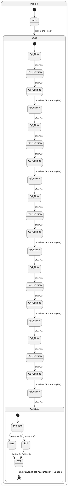
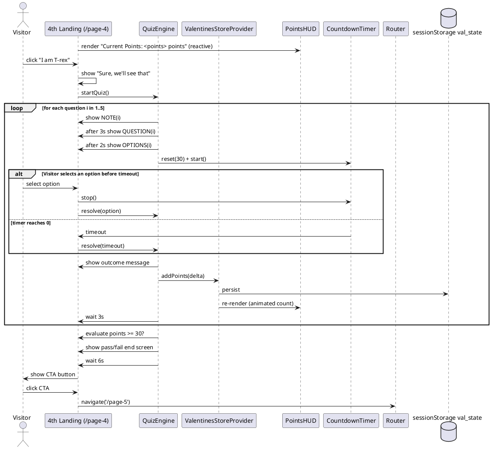
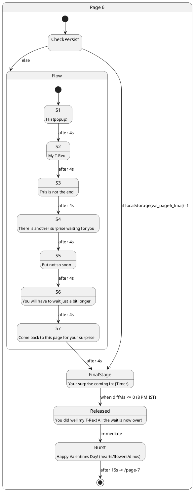
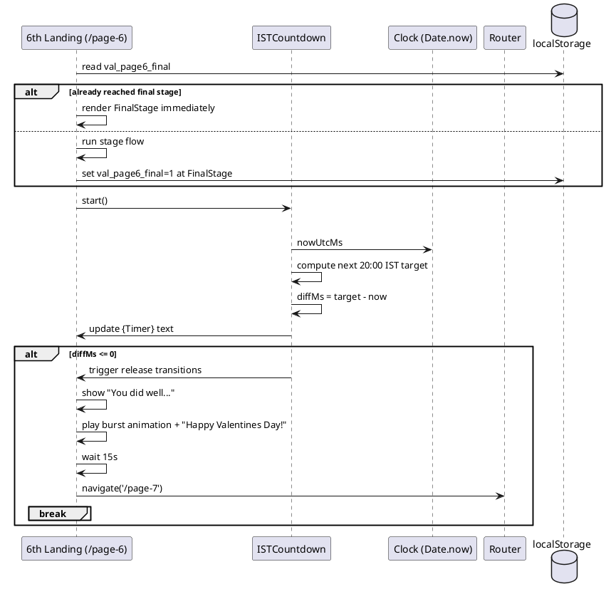

# SPEC-001-Valentines Dino Date Webpage (Gate + Next Page)

## Background
You’re building a playful, modern, animated “Valentine’s Date invite” website for your fiancé, **Sakina**. The experience is intentionally whimsical (dinosaurs + love) and begins with a “secret” gate question. The first milestone is to implement the **opening landing page** with a prompt and password input, and then route to the **next landing page** after a correct answer.

This spec covers **only**:
- Landing Page 1 (Gate): “Are you my dinosaur?” + password validation
- Landing Page 2 (Post-Gate): a beautiful animated transition + placeholder content for the next scene

---

## Requirements

### Must Have
- **Gate Page** at site root (`/`)
  - Shows the question text: **“Are you my dinosaur?”**
  - Shows an input field for a password
  - Accepts all common variants of **T‑Rex** (case-insensitive, whitespace + punctuation tolerant)
  - On correct password, transitions to **2nd Landing Page**
  - On incorrect password, **stay on the same page** and show message: **“Nice Try Evil Dino 😛”** with a friendly animated error state

- **2nd Landing Page** (`
ext`)
  - Loads only after successful gate entry during the current session
  - Starts by displaying: **“Hiiii Sakina ;)”**
  - Then runs this timed text flow (each stage pauses **3 seconds** before advancing):
    1. `Hiiii Sakina ;)`
    2. `My Dino`
    3. `My T-rex`
    4. `My Love`
    5. `My True Love`
    6. `My First Love`
    7. `My Last`
    8. `My Forever`
    - **Layout:** text is centered as a **single line** throughout the flow
  - Transition rules between stages:
    - Starting from the transition **into Stage 2 and onward**, animate edits as **word replacement** where applicable (the word to be removed morphs/animates into the new word).
    - If a stage is reached by **only adding** a word, animate the added word as a **pop-in**.
  - After the final stage (`My Forever`), wait **10 seconds**, then pop the question: **“Are you ready for the surprise?”**
  - **2 seconds later**, pop two buttons:
    - **“Yes, I am in”**
    - **“Hell yeah, I am innn!!!”**
  - Both buttons route to **3rd Landing Page** (`/page-3`) while recording which button was selected.

- **Global Points Counter (Persistent Across Pages)**
  - Maintain a `points` value that persists across navigation and refreshes during the same browser session.
  - Must not reset when moving between pages.
  - Updates are driven by user choices (see Page 3 behavior).

- **3rd Landing Page** (`/page-3`)
  - On load, show a message based on the previous choice from Page 2:
    - If previous choice was **“Yes, I am in”** → show: `Wrong answer :(
-5 points.` and **subtract 5** from points
    - If previous choice was **“Hell yeah, I am innn!!!”** → show: `Correct answer :)
+5 points.` and **add 5** to points
  - Display the **current points** somewhere visible (subtle HUD).
  - After the initial message is displayed, wait **5 seconds** and transition to:
    - `Are you ready my T-rex?`
  - **3 seconds after** that question appears, show two buttons:
    - **“Yes, I am in”**
    - **“Hell yeah, I am innn!!!”**
  - On selection:
    - If **“Yes, I am in”** → show: `You never learn do you :(
-10 points` and **subtract 10**
    - If **“Hell yeah, I am innn!!!”** → show: `Correct answer :)
+5 points.` and **add 5**
  - After showing the selection result, wait **4 seconds**, then navigate to **4th Landing Page** (`/page-4`).

- **4th Landing Page** (`/page-4`) — Anti‑Impostor Quiz
  - Always display a points HUD in the **top-right**:
    - `Current Points: <points> points`
    - Must update immediately with any points changes (animated count-up/down).
  - Intro copy (centered, readable):
    - `Before I show you the surprise my love I need to make sure that you are not an evil imposter Dino trying to ruin my surprise for my T-rex. So answer the 5 questions and get at least 30 points in order to prove me you are my one and only T-rex.`
  - After **3 seconds**, show a button: **“I am T-rex”**
  - On click:
    - Show: `Sure, we'll see that`
    - Transition into the quiz flow.

  **Quiz mechanics (for each question 1–5):**
  - Each question has a **Note**, then the **Question**, then **Options**.
  - Timing per question:
    - Show **Note** immediately.
    - **3 seconds later** show the question text.
    - **2 seconds later** show the options.
  - Also show a **30-second countdown timer** under the points HUD while the question is active.
    - Timer resets to **30** at the start of each new question.
    - If the timer reaches **0** before a selection, auto-advance using a default outcome:
      - Show message: `Time's up! My T-rex needs to be faster. | -5 points`
      - Apply **-5 points**, animate the HUD update, then proceed after 3 seconds.
  - Options display format:
    - The UI shows option label (e.g., `Nepal`) and may optionally show the bracket text as smaller subtext.
  - On selection:
    - Immediately show the message from the bracket.
    - Apply the point delta from the bracket to the global `points` (with animation).
    - Wait **3 seconds**, then move to the next question.

  **Questions (exact content):**
  - Note 1) `Let's start where it all began!`
    - Q1) `Where was I born?`
      - A) `Nepal` *(I was born in India! You definitely seem like an impostor. | -10 points)*
      - B) `Jhankaria Hospital` *(Wrong, are you really my T-Rex? | -5 points)*
      - C) `Dholkawala Hospital` *(Right! I knew you were my T-rex. | +10 points)*
      - D) `Saifee Hospital` *(Wrong, are you really my T-Rex? | -5 points)*
  - Note 2) `Let's see how well you know me.`
    - Q2) `How many phones have I broken/changed until now?`
      - A) `1` *(Seriously, there is no way you are my T-Rex. | -10 points)*
      - B) `3` *(Wrong, are you really my T-Rex? | -5 points)*
      - C) `4` *(Wrong, are you really my T-Rex? | -5 points)*
      - D) `5` *(Right! I knew you were my T-rex. | +10 points)*
  - Note 3) `Let's see if you know what I groove to.`
    - Q3) `Who was my top Spotify artist for 2025?`
      - A) `Taylor Swift` *(I never doubted you for a second my beloved T-rex. | +10 points)*
      - B) `Gracie Abrams` *(Wrong, are you really my T-Rex? | -5 points)*
      - C) `Kanye West` *(I am pretty sure you are an impostor. | -10 points)*
      - D) `Griff` *(Wrong, are you really my T-Rex? | -5 points)*
  - Note 4) `Let's get a little serious, shall we.`
    - Q4) `What is the name of the book I am currently reading?`
      - A) `Too Good to be Real` *(Wrong, are you really my T-Rex? | -5 points)*
      - B) `Too Good to be True` *(Right! My T-Rex knows me so well. | +10 points)*
      - C) `Too Good to Exist` *(Wrong, are you really my T-Rex? | -5 points)*
      - D) `Too Good to Last` *(Wrong, are you really my T-Rex? | -5 points)*
  - Note 5) `This is your final chance to prove your innocence!`
    - Q5) `When was the first time I called you T-rex?`
      - A) `4th Jan` *(I knew you were the imposter :( | -10 points)*
      - B) `4th Feb` *(Wrong, are you really my T-Rex? | -5 points)*
      - C) `7th February` *(Right! My beloved T-rex, I knew it was you. | +10 points)*
      - D) `10th February` *(Wrong, are you really my T-Rex? | -5 points)*

  **After Q5:**
  - If `points >= 30`:
    - Transition to an empty/clean end screen
    - Show: `Yayyyy, you did it! You proved that you are my one and only true love, my T-Rex 💖`
    - After **6 seconds**, show a button: **“I wanna see my surprise!”** → routes to `/page-5`
  - Else (`points < 30`):
    - Transition to an empty/clean end screen
    - Show: `Don't worry! I know you are my one and only true love, T-Rex. Even though you messed up, I'm not letting you go cause you are mine forever now.`
    - After **6 seconds**, show a button: **“I wanna see my surprise!”** → routes to `/page-5`

- **Modern UI + animations**
  - Smooth page transitions
  - Micro-interactions (hover, focus, button press)
  - At least one 3D element or pseudo-3D effect relating to dinosaurs/love
- **Mobile-first** and responsive
- **Fast load** and good Lighthouse basics (performance, accessibility)

### Should Have
- Gentle, romantic sound toggle (off by default)
- Reduced motion support (prefers-reduced-motion)
- Subtle ambient background animation (particles / floating hearts / stars)

### Could Have
- A “forgot password?” playful hint (configurable)
- Optional confetti burst on success

### Won’t Have (for this phase)
- Real security / authentication
- Backend user accounts
- Storing personally identifiable information

---

## Method

### Line Break Convention
Anywhere the content uses `
`, it indicates a **new line** in the rendered text (e.g., in banners and result messages). (In earlier drafts this was written as `/n`; this spec standardizes on `
`.)

### Architecture Overview
This is a **static-first** web app with rich client-side animation.

**Recommended stack (confirmed):**
- **Next.js (App Router)** for routing + transitions
- **React** UI components
- **Tailwind CSS** for modern styling
- **Framer Motion** for UI + page transitions
- **Three.js via @react-three/fiber** for 3D dinosaur/love object(s)
- Optional: **GSAP** for timeline-heavy sequences

> Note: The “password” is a playful gate and should be treated as **UX** rather than security. The correct answer will be present in client code.

### Routing
- `/` : Gate Page
- `/next` : 2nd Landing Page (requires a short-lived session flag)
- `/page-3` : 3rd Landing Page (points + commitment test)
- `/page-4` : 4th Landing Page (5-question anti-impostor quiz with timer)
- `/page-5` : 5th Landing Page (the surprise + proposal)
- `/page-6` : 6th Landing Page (countdown to 8 PM IST surprise)
- `/page-7` : 7th Landing Page (placeholder for next spec)

### Gate State & Guard
Because there is no real backend, we use a **client-only session flag**:
- On success, set `sessionStorage["val_gate_ok"] = "1"`
- `
ext` (and beyond) checks this flag on mount:
  - If missing → redirect back to `/`

This avoids accidental direct navigation, but is not a security boundary.

### Persistent State (Points + Last Choice + Page 6 Progress)
We need state that survives route transitions (and for Page 6, survives reload/reopen).

**State variables:**
- `points: number`
- `lastChoicePage2: "yes" | "hell" | null` (used by Page 3 on load)
- `page6ReachedFinalStage: boolean` (locks Page 6 at its last stage once reached)

**Persistence strategy (MVP):**
- Use a small client-side store + `sessionStorage` hydration.
  - On any update: write JSON to `sessionStorage["val_state"]`
  - On app load: read from `sessionStorage` and hydrate

**Page 6 persistence:**
- Use `localStorage["val_page6_final"] = "1"` once the final stage is reached.
  - This ensures the last stage persists across reloads and browser restarts.

**Why localStorage for Page 6?**
- Requirement: remain on the last stage even if reopened later.

**Note:** This is still UX persistence, not security.

### Password Matching Algorithm
Normalize user input:
- `trim()`
- lowercase
- remove all whitespace
- remove punctuation/hyphens/underscores (e.g., replace `[^a-z0-9]` with empty)

Validation:
- Accept if the normalized result equals: `trex`

**Examples accepted:**
- `T-Rex`, `t-rex`, `T Rex`, `t rex`, `TREX`, `trex`, `  t   rex `, `t_rex`, `t.rex`

### Stage Text Flow (2nd Landing Page)
We implement a deterministic timeline with explicit durations.

**Stages (display text + duration):**
- Stage 1: `Hiiii Sakina ;)` — 3s
- Stage 2: `My Dino` — 3s
- Stage 3: `My T-rex` — 3s
- Stage 4: `My Love` — 3s
- Stage 5: `My True Love` — 3s
- Stage 6: `My First Love` — 3s
- Stage 7: `My Last` — 3s
- Stage 8: `My Forever` — 3s
- Hold after Stage 8: 10s
- Then show question: `Are you ready for the surprise?`
- 2s later show two CTA buttons (both navigate to `/page-3`)

**Animation rule:**
- For transitions starting from **Stage 1 → Stage 2 and onward**, animate token changes.
  - If a word is replaced (e.g., `Dino` → `T-rex`), animate as **replace/morph**.
  - If a word is only added (e.g., `My Love` → `My True Love` adds `True`), animate the added token as a **pop-in**.

Implementation approach:
- Tokenize each stage by whitespace into tokens.
- Compute a simple diff between previous and next tokens:
  - If same length and only one token differs → treat as **replacement** at index.
  - If next = prev + one extra token inserted → treat as **insert/pop**.
  - Otherwise fall back to crossfade between full strings.

### UI/Animation Design (Phase 1)

#### Gate Page Visuals
- Background: animated gradient + faint floating hearts/stars
- Foreground: centered card with a playful dino silhouette
- 3D accent (lightweight):
  - A small floating **3D heart** or **tiny dino** model
  - Alternatively a pseudo-3D “parallax” dino sticker if you want minimal dependencies

#### Success Transition
- On correct password:
  - Button becomes a “launch” animation
  - Card dissolves / slides away
  - Optional confetti burst
  - Then route to `
ext` with a smooth page transition

#### Error State
- Shake animation on input
- Cute helper text (e.g., “Hmm… that doesn’t sound like a dinosaur I know 🦖”) with fade-in

#### Reduced Motion
If `prefers-reduced-motion: reduce`:
- Disable shake/confetti and use simple fades

### Components
- `GatePage`
  - `QuestionHeader`
  - `PasswordInput`
  - `PrimaryButton`
  - `AnimatedBackdrop`
  - `Dino3DAccent` (optional)
- `NextPage` (2nd landing)
  - `SceneWrapper` (background + transitions)
  - `HeroTextFlow` (timed stages + token animations)
  - `ChoiceButtons` (records selection + routes)
- `Page3`
  - `PointsHUD` (shows current points)
  - `ResultBanner` (correct/wrong + delta)
  - `CommitmentQuestion` (timed question + delayed buttons)
- `Page4` (Quiz)
  - `PointsHUD` (top-right, always visible)
  - `CountdownTimer` (under HUD)
  - `QuizIntro`
  - `QuizQuestionStage` (note → question → options)
  - `OptionButton`
  - `OutcomeBanner` (message after selection)
  - `QuizEndScreen`
- `Page5`
  - `SurpriseIntroAnimation` (hearts + flowers)
  - `TypewriterLetter` (typewriter text + sound)
  - `ValentinePrompt` (staged lines + word-by-word append)
  - `YesNoButtons` (No evasive + unclickable)
  - `YesSuccessScreen`
- `Page6`
  - `Page6StageFlow` (staged text transitions + persistence)
  - `ISTCountdown` (live countdown to 8 PM IST)
  - `FinalSurpriseBurst` (vibrant hearts/flowers/dinos)
- `Page7` (placeholder)
- `RouteGuard`
  - checks `sessionStorage` and redirects
- `ValentinesStoreProvider`
  - provides `points` + setters + `lastChoicePage2` globally

### Data Model
No backend storage required.

Client-side persisted state (session-scoped):
```ts
type ValentinesState = {
  points: number;
  lastChoicePage2: "yes" | "hell" | null;
  page6ReachedFinalStage?: boolean; // derived from localStorage for Page 6
};
```

Quiz configuration (static, in code):
```ts
type QuizOption = {
  id: "A"|"B"|"C"|"D";
  label: string;
  outcomeMessage: string;
  delta: number; // points to add/subtract
};

type QuizQuestion = {
  note: string;
  question: string;
  options: QuizOption[];
};
```

Optional static configuration:
- `gateQuestion: string`
- `gateAnswerVariants: string[]` (informational; algorithm normalizes to `trex`)
- `quiz: QuizQuestion[]`
No backend storage required.

Client-side persisted state (session-scoped):
```ts
type ValentinesState = {
  points: number;
  lastChoicePage2: "yes" | "hell" | null;
};
```

Optional static configuration:
- `gateQuestion: string`
- `gateAnswerVariants: string[]` (informational; algorithm normalizes to `trex`)
No persistent data required.

Optional configuration object (static):
- `gateQuestion: string`
- `gateAnswer: string` ("T-Rex")
- `acceptVariants: string[]` (optional)

### PlantUML

#### Component Diagram
```plantuml
@startuml
skinparam componentStyle rectangle

actor "Visitor (Sakina)" as U

component "Browser" as B
component "Next.js App" as APP
component "Gate Page /" as G
component "2nd Landing 
ext" as N2
component "3rd Landing /page-3" as P3
component "4th Landing /page-4" as P4
component "Animation Layer
(Framer Motion + R3F/Three.js)" as A

component "Valentines Store Provider" as VP

database "sessionStorage
val_gate_ok" as S1
database "sessionStorage
val_state {points,lastChoicePage2}" as S2

U --> B
B --> APP

APP --> VP
VP --> S2 : hydrate/persist

APP --> G
G --> A
G --> S1 : set flag on success

APP --> N2
N2 --> S1 : check flag
N2 --> VP : set lastChoicePage2
N2 --> A
N2 --> P3 : navigate

APP --> P3
P3 --> S1 : check flag (optional)
P3 --> VP : read lastChoice + update points
P3 --> A
P3 --> P4 : navigate after timeline

APP --> P4
P4 --> A

P3 --> G : redirect if no gate flag
N2 --> G : redirect if no gate flag

@enduml
```
plantuml
@startuml
skinparam componentStyle rectangle

actor "Visitor (Sakina)" as U

component "Browser" as B
component "Next.js App" as APP
component "Gate Page /" as G
component "Next Page 
ext" as N
component "Animation Layer\n(Framer Motion + R3F/Three.js)" as A

database "sessionStorage\n(val_gate_ok)" as S

U --> B
B --> APP
APP --> G
G --> A
G --> S : set flag on success
APP --> N
N --> S : check flag
N --> A
N --> G : redirect if flag missing

@enduml
```

#### Gate Flow Sequence
```plantuml
@startuml
actor Visitor
participant "Gate Page (/)" as Gate
participant "Validator" as Val
database "sessionStorage" as Store
participant "Router" as R

Visitor -> Gate: Enter password + Submit
Gate -> Val: normalize(input)
Val --> Gate: valid? (true/false)

alt valid
  Gate -> Store: set val_gate_ok=1
  Gate -> R: navigate('
ext')
else invalid
  Gate -> Gate: stay on page
  Gate -> Gate: show "Nice Try Evil Dino 😛" + shake
end
@enduml
```

#### Page 2 → Page 3 Choice + Points Sequence
```plantuml
@startuml
actor Visitor
participant "2nd Landing (
ext)" as P2
participant "ValentinesStoreProvider" as VP
participant "Router" as R
participant "3rd Landing (/page-3)" as P3

database "sessionStorage val_state" as S2

Visitor -> P2: Click choice button
P2 -> VP: setLastChoicePage2(choice)
VP -> S2: persist {points,lastChoicePage2}
P2 -> R: navigate('/page-3')

P3 -> VP: read lastChoicePage2
VP -> S2: hydrate if needed
P3 -> P3: apply initial delta once
P3 -> VP: addPoints(+5 or -5)
VP -> S2: persist
P3 -> P3: show result message
@enduml
```

#### Page 3 Commitment Timeline Sequence
```plantuml
@startuml
actor Visitor
participant "3rd Landing (/page-3)" as P3
participant "ValentinesStoreProvider" as VP
participant "Router" as R

database "sessionStorage val_state" as S2

P3 -> P3: show initial result text
P3 -> P3: wait 5s
P3 -> P3: show "Are you ready my T-rex?"
P3 -> P3: wait 3s
P3 -> Visitor: show two buttons

Visitor -> P3: Click a button
alt choice = "Yes, I am in"
  P3 -> VP: addPoints(-10)
  VP -> S2: persist
  P3 -> P3: show "You never learn do you :(
-10 points"
else choice = "Hell yeah, I am innn!!!"
  P3 -> VP: addPoints(+5)
  VP -> S2: persist
  P3 -> P3: show "Correct answer :)
+5 points."
end

P3 -> P3: wait 4s
P3 -> R: navigate('/page-4')
@enduml
```

#### Page 4 Quiz State Machine


#### Page 4 Quiz Sequence (Timers + Points)


#### Page 6 Countdown + Surprise State Machine


#### Page 6 Countdown Sequence (IST Target)



---

## Implementation

### Step 1 — Project Setup
- Create Next.js app (App Router)
- Add Tailwind CSS
- Add Framer Motion
- Add Three stack (optional for phase 1, recommended):
  - `three`, `@react-three/fiber`, `@react-three/drei`

### Step 2 — Build Gate Page (`/`)
- Layout: full-screen animated background + centered card
- Render question text: “Are you my dinosaur?”
- Input + button
- Implement validation:
  - Normalize to `trex`
  - Compare equality
- Error state (incorrect password):
  - Keep user on the same page
  - Input shake
  - Inline message: **“Nice Try Evil Dino 😛”**

### Step 3 — Success Path
- On success:
  - Set `sessionStorage` flag
  - Play success animation
  - Route to `
ext`

### Step 4 — Build 2nd Landing Page (`
ext`)
- Add guard:
  - If `sessionStorage.val_gate_ok` missing, redirect to `/`
- Add timed stage flow renderer:
  - Drive the stage index with a timeline:
    - 8 stages × 3 seconds each
    - then 10 second hold
    - then question
    - then 2 seconds later show buttons
  - Render tokens and animate diffs per rules (replace vs pop-in)
- Add CTA routing + record choice:
  - On click, store `lastChoicePage2` in the global store (and persisted session state)
  - Navigate to `/page-3`

### Step 5 — Add Global Store + Persistence
- Implement `ValentinesStoreProvider` using React Context (or Zustand) with:
  - `points`, `setPoints/addPoints`
  - `lastChoicePage2`, `setLastChoicePage2`
- Persist to `sessionStorage` under `val_state`
- Hydrate on first client render

### Step 6 — Build 3rd Landing Page (`/page-3`)
- On mount:
  - Read `lastChoicePage2`
  - Apply the corresponding points delta **once** (use a `hasAppliedInitialDelta` ref/flag)
  - Show the initial message:
    - yes → `Wrong answer :(
-5 points.`
    - hell → `Correct answer :)
+5 points.`
- Display `PointsHUD` continuously
- Timeline:
  - After initial message: wait 5s → show commitment question
  - After question appears: wait 3s → show buttons
- On button click:
  - Apply delta and show result text:
    - yes → `You never learn do you :(
-10 points`
    - hell → `Correct answer :)
+5 points.`
  - Wait 4s → navigate to `/page-4`

### Step 7 — Build 4th Landing Page (`/page-4`) Quiz
- Always render `PointsHUD` fixed top-right:
  - `Current Points: <points> points`
  - Animate number changes (count up/down)
- Intro message + delayed “I am T-rex” button (3s)
- On click, show “Sure, we'll see that” then start quiz state machine
- Implement quiz state machine:
  - `step: "intro" | "question" | "result" | "end"`
  - `qIndex: 0..4`
  - `phase: "note" | "question" | "options"`
  - `secondsLeft: 30..0`
- For each question:
  - reset `secondsLeft=30`
  - show note immediately
  - +3s show question
  - +2s show options
  - start countdown when options appear (recommended) or when note appears (acceptable); **must still be 30s total to answer**
  - on select or timeout:
    - stop timer
    - show outcome message
    - apply delta to global points
    - wait 3s → next question
- After Q5:
  - compute pass/fail (`points>=30`)
  - show end screen message
  - wait 6s → show CTA to `/page-5`

### Step 8 — Build 5th Landing Page (`/page-5`) Surprise + Valentine Question

**Scene 1: Empty → Surprise intro**
- Start with an empty/clean screen.
- Play a rich animation (Framer Motion + optional particle layer) with **lots of hearts and flowers**.
- Pop-in headline: `I am your surprise!`
- Then transition into the long love letter.

**Scene 2: Typewriter love letter (with sound)**
- Render the following text using a **typewriter effect** (character-by-character):

`I know we have not known each other for long and there are still a lot of things we need to discover about each other. On top of that I know this distance makes things harder. But for me it doesn't matter, cause the first time I laid my eyes on you I knew you were the one.

The one I wanna get flowers for, the one whose heels I carry, the one who I compete with, the one I lose to, the one I wanna laugh with, the one I wanna cry with, the one I have long calls with, the one I do long distance with, the one I hug, the one I kiss, the one and only that I love, the one I choose will always be you!`

- Add a **typewriter sound effect** synced with typing.
  - Sound defaults **OFF** (recommended) with a toggle.
  - Respect `prefers-reduced-motion` and also allow `prefers-reduced-transparency` if used.
- After typing completes, fade the letter out slightly or slide it upward to make room for the prompt.

**Scene 3: Valentine prompt (staged text building)**
- Show: `So will you do me the honor of being`
- After **3 seconds**, add below: `my Valentine`
- Then append `now` and `forever` and `after?` **one word at a time** to the same line as `my Valentine`, producing:
  - `my Valentine now forever after?`
- After the full line is assembled, wait **3 seconds**.

**Scene 4: Yes / No choice**
- Show two buttons: `Yes!` and `No`
- `No` behavior:
  - **Unclickable** (no click handler; also use `aria-disabled=true`)
  - On hover (or even near-hover / pointer proximity), it **jumps** to a random position within safe bounds of the viewport/container.
  - Continues evading until `Yes!` is clicked.
  - Ensure it never jumps off-screen (clamp within margins).

**Scene 5: Yes success → navigate to Page 6**
- On `Yes!` click:
  - Transition to success message:

`Yaayyyyy you made the right choice my T-Rex!
 It's a date!`

  - Wait **10 seconds**
  - Then navigate to **6th Landing Page** (`/page-6`).

### Step 9 — Build 6th Landing Page (`/page-6`) Countdown Surprise

**Stage flow (initial run only):**
- Start blank.
- Pop-in (popup) stage 1: `Hiii`
- Then, for each subsequent stage:
  - Wait **4 seconds**
  - Transition to next stage using a **smooth + funky** animation

Stages:
1. `Hiii` *(popup transition)*
2. `My T-Rex`
3. `This is not the end`
4. `There is another surprise waiting for you`
5. `But not so soon`
6. `You will have to wait just a bit longer`
7. `Come back to this page for your surprise`
8. `Your surprise coming in: {Timer}` *(this is the final stage; stay here)*

**Persistence rule:**
- Once stage 8 is reached, set `localStorage["val_page6_final"] = "1"`.
- On page load, if that flag exists, **skip** the stage flow and immediately render stage 8.

**{Timer} requirement (countdown to 8 PM IST):**
- `{Timer}` must count down to **8:00 PM IST**.
- It must stay accurate while the page is stationary (no reload).
- Format example: `48 hrs : 30 min : 45 sec`

**Timer algorithm (timezone-safe):**
- Compute the next target instant of **20:00 in Asia/Kolkata**.
  - If current time in IST is before 20:00 → target is today 20:00 IST
  - Else → target is tomorrow 20:00 IST
- Convert that target instant to UTC milliseconds and compute `diffMs = targetUtcMs - Date.now()`.
- Update display every 250–1000ms via `setInterval` (1s is fine).
- Clamp at 0 (no negatives): `max(diffMs, 0)`.

Implementation options:
- **Recommended (robust):** use `luxon` and `setZone("Asia/Kolkata")` to compute the next 20:00 reliably.
- **No-dependency fallback:** approximate by converting `Date.now()` to IST via `Intl.DateTimeFormat` + parsing, but this is more error-prone.

**After timer reaches 0 (8 PM IST or later):**
- If `diffMs <= 0` at any tick (or on initial load):
  - Transition to: `You did well my T-Rex! All the wait is now over!`
  - Then play a vibrant surprise animation and pop:
    - `Happy Valentines Day!`
    - with lots of hearts, flowers, dinos and other animations
  - After **15 seconds**, navigate to **7th Landing Page** (`/page-7`).

### Step 10 — Add 7th Landing Page Route Placeholder (`/page-7`)
- Minimal placeholder page for now

### Step 11 — Polish
- Keyboard accessibility:
  - Enter submits on gate page
  - Visible focus ring
  - ARIA labels for input and buttons
- Mobile layout testing
- prefers-reduced-motion behavior
- Ensure timers are paused/stopped on unmount (avoid setState after unmount)

- Keyboard accessibility:
  - Enter submits on gate page
  - Visible focus ring
  - ARIA labels for input and buttons
- Mobile layout testing
- prefers-reduced-motion behavior
- Ensure timers are paused/stopped on unmount (avoid setState after unmount)

- Keyboard accessibility:
  - Enter submits on gate page
  - Visible focus ring
  - ARIA labels for input and buttons
- Mobile layout testing
- prefers-reduced-motion behavior
- Ensure timers are paused/stopped on unmount (avoid setState after unmount)

- Keyboard accessibility:
  - Enter submits on gate page
  - Visible focus ring
  - ARIA labels for input and buttons
- Mobile layout testing
- prefers-reduced-motion behavior
- Ensure timers are paused/stopped on unmount (avoid setState after unmount)

- Keyboard accessibility:
  - Enter submits on gate page
  - Visible focus ring
  - ARIA labels for input and buttons
- Mobile layout testing
- prefers-reduced-motion behavior
- Ensure timers are paused/stopped on unmount (avoid setState after unmount)


- Keyboard accessibility:
  - Enter submits
  - Visible focus ring
- Mobile layout testing
- prefers-reduced-motion behavior

---

## Milestones
1. **M1: Gate Page UI**
   - Question + input + button
   - Responsive card + basic animations
2. **M2: Validation + Error Handling**
   - Accept common `T-Rex` variants
   - Incorrect password stays on page and shows “Nice Try Evil Dino 😛”
3. **M3: Success Transition + Routing**
   - session flag set
   - animated route transition to `/next`
4. **M4: 2nd Landing Page Timed Flow**
   - 8-stage, 3s-per-stage text sequence
   - word replace / pop-in animations
5. **M5: Surprise Prompt + CTA (to Page 3)**
   - 10s hold after last stage
   - question + delayed buttons
   - record choice + route to `/page-3`
6. **M6: Page 3 Points + Commitment Timeline**
   - initial points delta based on Page 2 choice
   - question + delayed buttons
   - route to `/page-4`
7. **M7: Page 4 Quiz + Timer + HUD**
   - intro + start button
   - 5 questions with note/question/options staging
   - 30s countdown each question
   - animated points updates
   - pass/fail end screen + CTA to `/page-5`
8. **M8: Page 5 Surprise + Typewriter + Evasive No**
   - hearts/flowers intro + "I am your surprise!"
   - typewriter letter + sound toggle
   - staged valentine prompt + word-by-word build
   - evasive unclickable No + Yes success
   - route to `/page-6`
9. **M9: Page 6 Countdown to 8 PM IST + Final Burst**
   - staged text flow (4s per stage) that locks on final stage
   - persistent final stage on reload/reopen (localStorage)
   - live countdown timer to 20:00 IST
   - when timer hits 0: vibrant "Happy Valentines Day!" burst
   - after 15s route to `/page-7`
10. **M10: Accessibility + Reduced Motion**
   - keyboard, focus, aria labels
   - reduced motion fallback

---

## Gathering Results
- **Functional checks**
  - Correct password (`T-Rex`) reliably routes to `
ext`
  - Incorrect passwords show error state and do not route
  - Direct navigation to `
ext` redirects to `/`
- **UX checks**
  - Animations are smooth on mobile and desktop
  - Reduced motion users see non-intrusive fades
- **Performance checks**
  - 3D assets are lightweight (or lazy-loaded)
  - Page loads quickly on a mobile network

---

## Need Professional Help in Developing Your Architecture?
Please contact me at [sammuti.com](https://sammuti.com) :)

